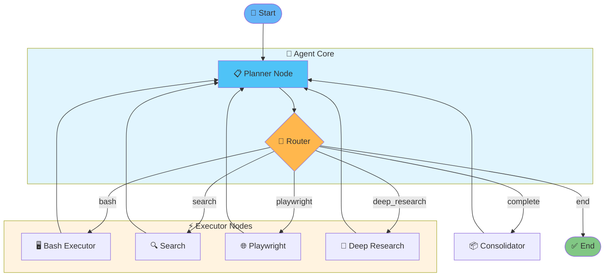

# 🤖 Manus Agent

> Autonomous AI agent inspired by [Manus.im](https://manus.im) with LangGraph orchestration.

An intelligent agent capable of executing complex tasks autonomously, including web research, code execution, and file manipulation within a secure sandboxed environment.

## ✨ Features

- **LangGraph-based orchestration** - Modular graph architecture for flexible agent workflows
- **Multi-LLM support** - Works with Anthropic (Claude), OpenAI, and OpenRouter
- **Deep Research Mode** - Comprehensive multi-source web analysis with citations
- **Secure Sandbox** - Isolated Docker container for safe code execution
- **Interactive CLI** - Real-time progress display with verbose mode

## 📋 Prerequisites

- Python 3.11+
- [uv](https://github.com/astral-sh/uv) (recommended) or pip
- Docker (for sandbox execution)

## 🚀 Quick Start

### 1. Clone and Install

```bash
# Clone the repository
git clone <repository-url>
cd manus-agent

# Install dependencies with uv
uv sync

# Or with pip
pip install -e .
```

### 2. Configure Environment

```bash
# Copy the example environment file
cp .env.example .env

# Edit .env with your API keys
```

**Required settings in `.env`:**

```env
# Choose your LLM provider: anthropic, openai, or openrouter
LLM_PROVIDER=anthropic

# Set the API key for your chosen provider
ANTHROPIC_API_KEY=your_key_here
# OPENAI_API_KEY=your_key_here
# OPENROUTER_API_KEY=your_key_here

# Model to use
LLM_MODEL=claude-sonnet-4-20250514
```

### 3. Start the Sandbox

```bash
docker-compose up -d
```

### 4. Run the Agent

```bash
# Interactive mode
uv run python main.py

# With a specific task
uv run python main.py "List files in workspace"

# Deep research mode
uv run python main.py "Research quantum computing applications" --deep-research
```

## 📖 Usage

### Command Line Options

```
python main.py [query] [options]

Options:
  -v, --verbose       Enable verbose output (default: True)
  -q, --quiet         Disable verbose output
  -d, --debug         Enable debug logging
  --max-steps N       Maximum number of execution steps
  --deep-research     Enable deep research mode for comprehensive analysis
```

### Examples

```bash
# Simple task execution
uv run python main.py "Create a Python script that prints Hello World"

# Deep research with detailed report
uv run python main.py "What are the latest developments in LangGraph?" --deep-research

# Debug mode for troubleshooting
uv run python main.py "Analyze the /workspace directory" --debug
```

## 🏗️ Architecture

### Agent Graph Flow



### Project Structure

```
manus-agent/
├── main.py                 # CLI entry point
├── agent_graph.py          # LangGraph agent definition
├── agent_state.py          # State management
├── router.py               # Action routing logic
├── llm_factory.py          # Multi-provider LLM factory
├── seedbox_executor.py     # Docker/SSH sandbox executor
├── deep_research_*.py      # Deep research components
├── nodes/                  # Agent node implementations
│   ├── planner.py          # Task planning
│   ├── bash_executor.py    # Command execution
│   ├── reflection.py       # Self-reflection
│   ├── consolidator.py     # Result consolidation
│   ├── research_planner.py # Research query planning
│   ├── search_summarize.py # Web search & summarization
│   └── report_writer.py    # Report generation
├── workspace/              # Agent workspace (mounted in sandbox)
└── tests/                  # Test suite
```

## 🔧 Configuration

### Sandbox Modes

| Mode | Description |
|------|-------------|
| `docker` | Uses local Docker container (recommended) |
| `ssh` | Connects to remote SSH server |

### Execution Settings

| Variable | Default | Description |
|----------|---------|-------------|
| `EXECUTION_TIMEOUT` | 30 | Command timeout in seconds |
| `MAX_OUTPUT_LENGTH` | 5000 | Maximum output characters |
| `MAX_ITERATIONS` | 30 | Maximum agent iterations |

## 🧪 Testing

```bash
# Run all tests
uv run pytest

# Run with coverage
uv run pytest --cov=.
```

## 📄 License

MIT License

## 🤝 Contributing

Contributions are welcome! Please feel free to submit a Pull Request.
